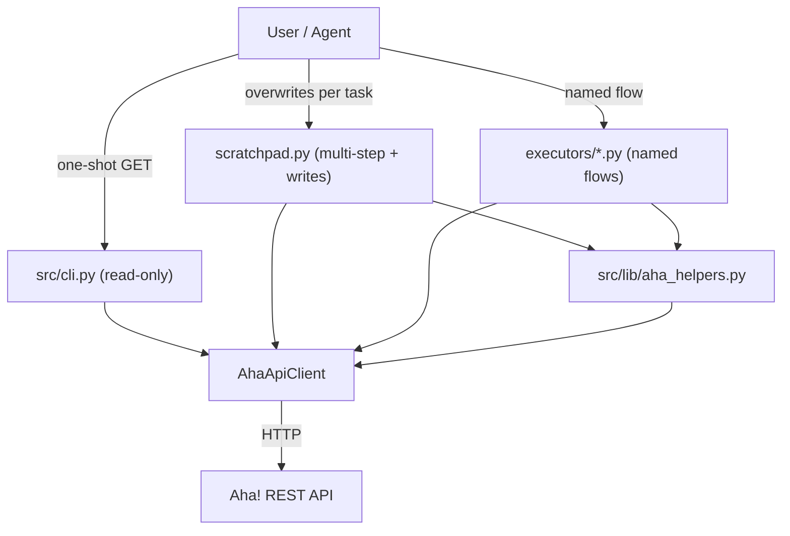

# AhaAgent Architecture

High-level structure and dependency rules for the Aha! management agent.

## Module Map

| Path | Purpose |
|------|---------|
| `src/api/` | `client.py` — Aha! REST client; `jira_client.py` — Jira Cloud read-only (Basic auth, 429 retry); `jira_adf.py` — flatten Jira description ADF to plain text |
| `src/cli.py` | Read-only CLI: `python -m src.cli get|paginate` for ad-hoc Aha! lookups |
| `src/lib/` | `aha_helpers.py` — shared helpers (pagination, IDF matching, backlog fetch) used by executors and scratchpads |
| `src/executors/` | Named flows + scratchpad — `scratchpad.py`, `test_api.py`, `suggestion_review.py`, `check_missing_jira.py`, `jira_board_overview.py`, `jira_pm_brief_generate.py` |
| `docs/` | API notes, Celonis taxonomy, design docs, exec plans, references |
| `data/intake/` | Fallback when `KNOWLEDGE_ROOT` is unset: task lists; **gitignored** |
| `data/archive/` | Fallback archive; **gitignored** except `.gitkeep` |
| `data/jira-briefs/`, `data/feature-suggestions/` | Fallback Jira / feature-suggestion outputs; **gitignored** |
| `src/pm_data_paths.py` | Resolves paths: `$KNOWLEDGE_ROOT/AhaAgent/{intake,jira-briefs}/`, `$KNOWLEDGE_ROOT/incoming/feature-suggestions/`, or `data/...` when no vault |
| *(vault)* `$KNOWLEDGE_ROOT/AhaAgent/` | Glossary, Products, Meetings, intake, jira-briefs (not in this repo) |
| *(vault)* `$KNOWLEDGE_ROOT/incoming/feature-suggestions/` | Dated `aha_feature_suggestions` exports (not in this repo) |
| *(vault)* `Tasks/`, `GOALS.md` | At vault root; meeting-notes “Related” scans |

## Layer Diagram

## Dependency Rules

1. **Executors and CLI depend on api** — they import `AhaApiClient` and/or `JiraApiClient` from `src.api`.
2. **`src/lib/` depends only on `src/api/`** — helpers may import the client but never an executor.
3. **No circular dependencies** — `src/api/` imports nothing from `src/executors/`, `src/cli.py`, or `src/lib/`.
4. **Docs are read-only** — Scripts reference `docs/` for conventions; docs do not import code.

## Entry Points

| Entry Point | Purpose |
|-------------|---------|
| `python -m src.cli get <path>` | Read-only one-shot GET. Preferred for ad-hoc Aha! lookups. |
| `python -m src.cli paginate <path> --collection <key>` | Auto-page a list endpoint into one JSON array. |
| `src/executors/scratchpad.py` | Primary execution script for multi-step or write Aha! operations. Overwrite for each new task. Imports from `src/lib/aha_helpers.py`. |
| `src/executors/suggestion_review.py` | Feature Suggestion review: fetch portal Ideas, cross-reference backlog, emit JSON report. |
| `src/executors/test_api.py` | API connection test. Run to verify credentials and network. |
| `src/executors/jira_board_overview.py` | Read-only Jira overview: **`JIRA_JQL`** / `JIRA_JQL_PATH` (search) or **`JIRA_BOARD_ID`** (Agile board); optional **`--extra-fields`** for description + sprint; see [docs/jira_api_notes.md](docs/jira_api_notes.md). |
| `src/executors/jira_pm_brief_generate.py` | Build a **detailed** PM brief Markdown from `jira_board_overview.py --json` output: themes (component or epic), epic subsections, full per-issue tables; see [docs/jira_api_notes.md](docs/jira_api_notes.md). |

## Data Flow

1. **Intake** — With `KNOWLEDGE_ROOT` set, task lists go to **`$KNOWLEDGE_ROOT/AhaAgent/intake/`**; else `data/intake/` (not tracked by git).
2. **Translation** — Scripts resolve names to Aha! `reference_num` or `id` (see [docs/celonis_aha_rules.md](docs/celonis_aha_rules.md)).
3. **Execution** — `AhaApiClient` performs GET/POST/PUT/DELETE against `https://celonis.aha.io/api/v1`.
4. **Archive** — Completed task lists can move to `data/archive/` in the repo or an archive area in the vault (not tracked from this repo when under the vault).
