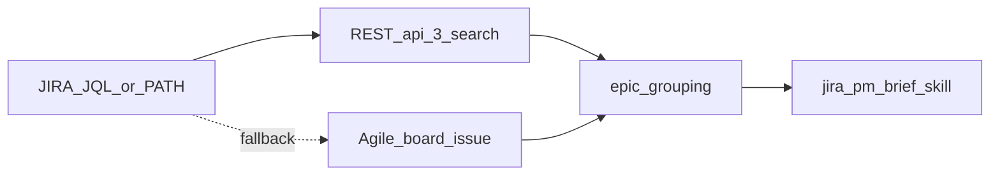

# Plan: JQL-first ML Infra overview and PM brief (Frederik)

**Status:** Implemented in repo (`jira_board_overview.py`, `JiraApiClient.search_issues`, `.env.example`, docs, skills).

## Goal

Make **JQL search** the **default** way for **PM Frederik Chettouh** to pull a **realistic** slice of what the **ML Infra** engineering team is working on (hundreds of issues, not 7k+ board history), then feed that into the **PM brief** workflow (`data/jira-briefs/`, gitignored).

## Canonical JQL

**Base slice** (agreed TM scope — not done, stories/tasks/bugs only, open sprint or unsprinted backlog):

```jql
project = TM AND issuetype NOT IN (Epic, Sub-task) AND statusCategory != Done AND (sprint IN openSprints() OR sprint IS EMPTY) ORDER BY Rank ASC
```

**ML Infra team** — append (component name matches Jira: `ML Infra`):

```jql
AND component = "ML Infra"
```

**Single-line `.env` example** (entire query on one line):

`project = TM AND issuetype NOT IN (Epic, Sub-task) AND statusCategory != Done AND (sprint IN openSprints() OR sprint IS EMPTY) AND component = "ML Infra" ORDER BY Rank ASC`

Frederik’s **live** query lives only in **`.env`** (or optional gitignored JQL file below)—never commit secrets or personal overrides beyond `.env.example` placeholders.

## Optional: multiline JQL file

If one line is hard to maintain, add **`JIRA_JQL_PATH`** (e.g. `data/jira-jql/ml-infra.jql`) — file under **`data/`** stays **gitignored** if placed outside `intake`/`archive` exceptions (top-level `data/jira-jql/` is ignored by current `data/*` rule). Document precedence: **`JIRA_JQL` env wins over path** if both set.

## Implementation tasks

### 1. Jira search API

- Use **`GET /rest/api/3/search`** with query params: `jql`, `startAt`, `maxResults` (≤100), `fields` (same comma-separated list as board fetch).
- Paginate until all issues fetched. Reuse **429** handling from [`src/api/jira_client.py`](../../src/api/jira_client.py) (`get()` is sufficient; optional thin `search_issues` helper).

### 2. [`src/executors/jira_board_overview.py`](../../src/executors/jira_board_overview.py)

- **Source selection:**
  1. If **`JIRA_JQL`** is non-empty **or** **`JIRA_JQL_PATH`** file exists → **search** path.
  2. Else if **`JIRA_BOARD_ID`** set → existing **board** path (backward compatible).
  3. Else → exit with clear error listing options.
- **After fetch:** unchanged pipeline — `get_fields` / epic link id, `build_epic_groups`, Markdown + `--json`.
- **JSON metadata:** add `source: "jql" | "board"`; optional omit full JQL from stdout if ever needed (usually fine for internal TM queries).
- **CLI (optional):** `--jql "..."` override for one-off runs.

### 3. [`.env.example`](../../.env.example)

- Document **`JIRA_JQL=`** with the ML Infra one-liner as the **recommended default** for this workflow.
- State **`JIRA_BOARD_ID`** optional when JQL is set.
- Document **`JIRA_JQL_PATH`** if implemented.

### 4. Docs and harness

| File | Update |
|------|--------|
| [`docs/jira_api_notes.md`](../jira_api_notes.md) | Search vs board; sprint/backlog semantics; ML Infra default for Frederik’s briefs |
| [`.cursor/skills/jira-board-overview/SKILL.md`](../../.cursor/skills/jira-board-overview/SKILL.md) | Prefer JQL from env for PM overview |
| [`.cursor/skills/jira-pm-brief/SKILL.md`](../../.cursor/skills/jira-pm-brief/SKILL.md) | Same; suggest brief filename `YYYY-MM-DD_tm-ml-infra-brief.md` when using this scope |
| [`AGENTS.md`](../../AGENTS.md) | Pointer: Jira PM slice = `JIRA_JQL` in `.env` (see jira_api_notes) |

### 5. Verification

- `python scripts/verify_harness.py`
- Local run: issue count in **~300–500** band vs **7k** full board; spot-check keys in Jira.
- `git status`: no tracked files under `data/jira-briefs/` after generating a brief.

## Out of scope (later)

- Saved **filter ID** instead of raw JQL  
- Quarter **`fixVersion`** / PI fields  
- Re-including **Sub-task** rollup  

## Dependency diagram


